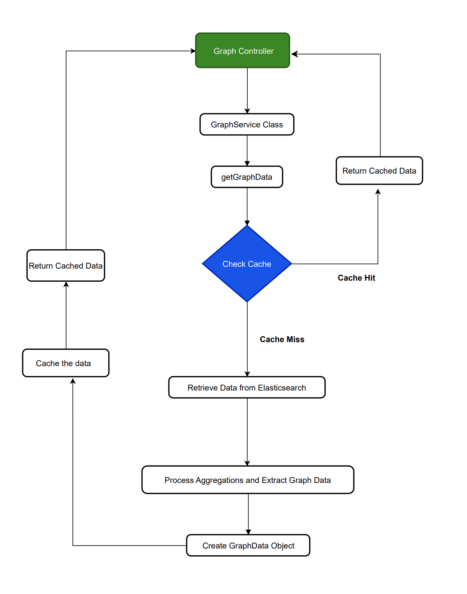

# Automated Network Analysis and Fault Detection System for Campus IT Infrastructure

This project aims to automate the monitoring and analysis of campus network performance, ensuring seamless operation and reducing downtime. The system integrates various data sources, machine learning models, and Elasticsearch for efficient data retrieval and processing.

## Table of Contents
- [Features](#features)
- [Technologies Used](#technologies-used)
- [Architecture](#architecture)
- [Setup and Installation](#setup-and-installation)
- [Usage](#usage)
- [Demo](#demo)
- [Future Enhancements](#future-enhancements)
- [Contributing](#contributing)
- [License](#license)

## Features
1. **Automated Monitoring**: Automatically monitors campus network performance, reducing the need for manual intervention.
2. **Key Features**: Includes Ping Processor, Graphs, Jitter Processor, and Email Alerts for comprehensive network analysis.
3. **Data Integration**: Collects data from various sources such as ping data, SNMP, firewall logs, DNS query logs, and DHCP server logs.
4. **Machine Learning Integration**: Utilizes NLP models (Word2Vec, BERT, DeBERTa) for URL categorization and predictive fault analysis.
5. **UI Integration**: Seamlessly integrates the backend with a user-friendly UI for real-time data interaction and visualization.

## Technologies Used
- **Java**: Core programming language
- **Spring Boot**: Framework for building the backend
- **RESTful APIs**: For communication between client and server
- **JSON**: Data interchange format
- **Elasticsearch**: For efficient data retrieval
- **Machine Learning**: NLP, Word2Vec, BERT, DeBERTa for URL categorization
- **JavaScript/HTML/CSS**: For frontend development
- **Apache Commons Email**: For sending alert emails

## Architecture
The system is composed of multiple layers and components:

1. **Backend (Java, Spring Boot)**:
   - **ProcessorService**: Processes ping and jitter log files into JSON.
   - **GraphService**: Generates graph data for visualization.
   - **ServerAnalysis**: Analyzes server data for performance metrics.
   - **EmailService**: Sends alert emails based on network events.
   - **URLCategorizationService**: Categorizes URLs using machine learning models.

2. **Frontend**: 
   - Provides a user-friendly interface for real-time data interaction.
   - Visualizes data using graphs, pie charts, and analysis windows.

3. **Data Sources**:
   - Collects data from ping logs, SNMP data, firewall logs, DNS query logs, and DHCP server logs.
   - Uses Elasticsearch queries for efficient data retrieval.

## Setup and Installation

### Prerequisites
- **Java JDK 8+**
- **Maven**
- **Node.js and npm**
- **Elasticsearch**

### Installation Steps

1. **Clone the repository**:
    ```bash
    git clone https://github.com/pushp1607/B.tech-project.git
    cd automated-network-analysis
    ```

2. **Backend Setup**:
    - Navigate to the backend directory:
        ```bash
        cd backend
        ```
    - Build the project using Maven:
        ```bash
        mvn clean install
        ```
    - Run the Spring Boot application:
        ```bash
        mvn spring-boot:run
        ```

3. **Frontend Setup**:
    - Navigate to the frontend directory:
        ```bash
        cd frontend
        ```
    - Install dependencies:
        ```bash
        npm install
        ```
    - Start the frontend application:
        ```bash
        npm start
        ```

4. **Elasticsearch Setup**:
    - Ensure Elasticsearch is installed and running on your system.

### Configuration
- Configure the backend application properties in `src/main/resources/application.properties` to connect to your Elasticsearch instance and other necessary configurations.

## Usage

1. **Access the Application**:
    - Open your browser and navigate to `http://localhost:3000` to access the frontend UI.
    
2. **Monitor Network Performance**:
    - Use the various features like Ping Processor, Graphs, Jitter Processor to monitor and analyze network performance.

3. **Receive Alerts**:
    - Ensure email alerts are configured correctly to receive notifications for critical network events.

## Demo

### Screenshots
1. **Dashboard**:
   
   
2. **Network Analysis Graphs**:
   
   
3. **Ping Processor**:
   

4. **Email Alerts**:
   

## Future Enhancements
- **Machine Learning Integration**: Implement advanced machine learning algorithms for predictive fault analysis.
- **Mobile Accessibility**: Introduce mobile support for the system.
- **Enhanced Reporting**: Improve reporting and analytics capabilities for detailed insights.
- **Customizable Alerts**: Allow users to customize alert conditions and notifications.

## Contributing
Contributions are welcome! Please read the [contributing guidelines](CONTRIBUTING.md) before submitting a pull request.

## License
This project is licensed under the MIT License. See the [LICENSE](LICENSE) file for details.

---

By following this README, you should be able to set up, run, and utilize the Automated Network Analysis and Fault Detection System for Campus IT Infrastructure effectively. If you encounter any issues or have suggestions, please feel free to open an issue on GitHub.
